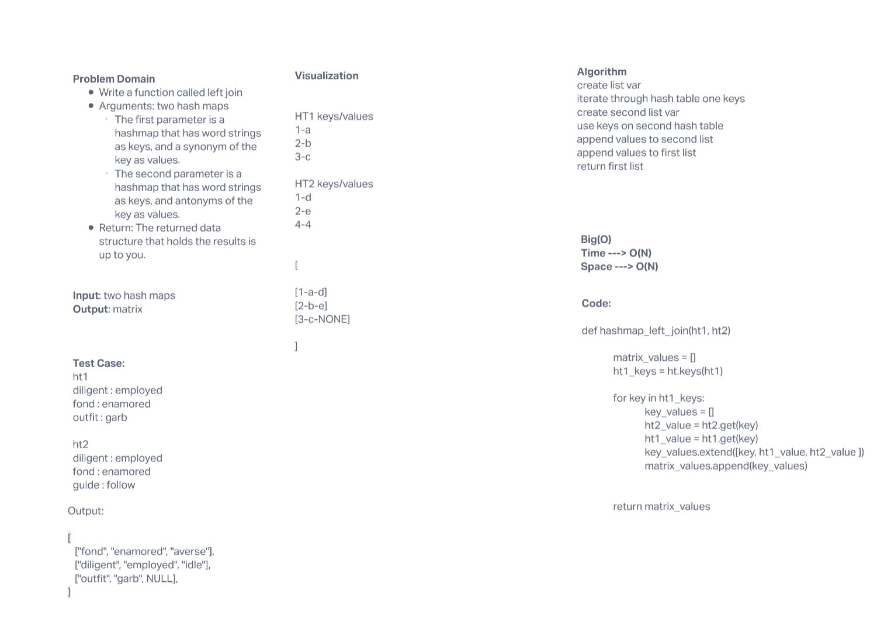

# Challenge Summary

Write a function called left_join that takes in two hashmaps and joins them in a single structure

## Whiteboard Process

## Approach & Efficiency

The algorithm takes the first hash table and create a list from its keys. It then iterates through that list checking whether the second hash table contains those keys. If it does contain the key it appends the key and both values to a list which is then appended to another list creating a matrix.

## Big 0

Time Complexity --> O(n) because it must iterate through the first hash table and create a list of keys.

## Solution

[code](python/code_challenges/hashtable_left_join.py)
