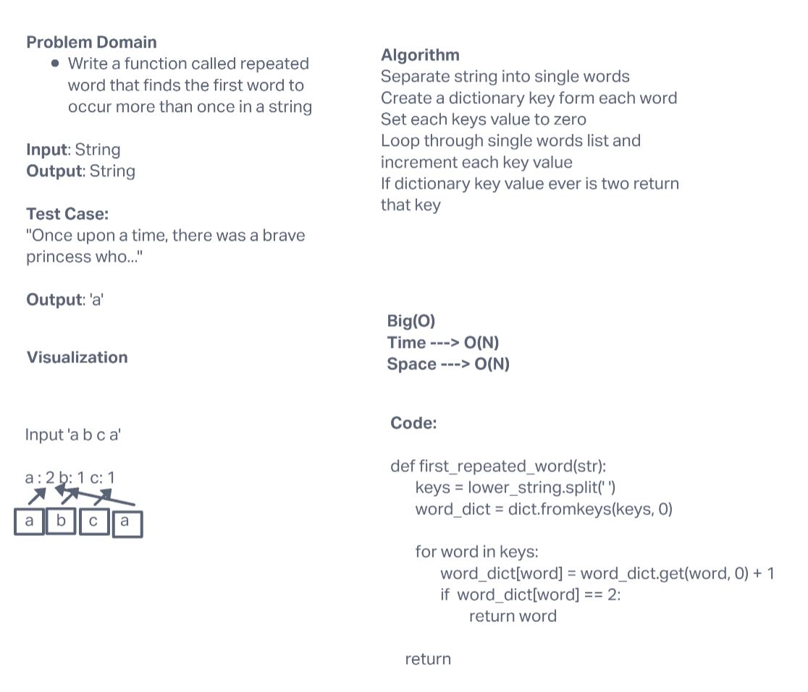

# Challenge Summary

Write a function called repeated word that finds the first word to occur more than once in a string

## Whiteboard Process

## Approach & Efficiency

This algorithms approach is to split the the string into a list and create a dictionary from each word. It then iterates through that original list incrementing each dictionary key as it is found. If any dictionary keys value reaches two it returns that key.

## Big 0

Time Complexity --> O(n) because worst case if there are no matching words it must iterate through the whole string.

## Solution

[code](python/code_challenges/hashtable_repeated_word.py)
