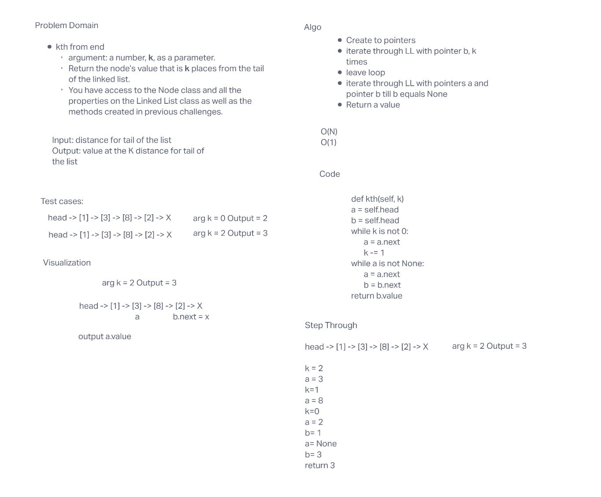

# Code challenges 08

## Singly Linked List

This is a linked list with the following methods included

- linked-list-kth()

### Challenge

Create a Linked List class

**The class should contain the following methods**

linked-list-kth

- Arguments: value
- Returns: nothing
- Adds a new node to value to the end of the list with an O(N) Time performance.

### Approach & Efficiency

linked-list-kth() - O(N)

