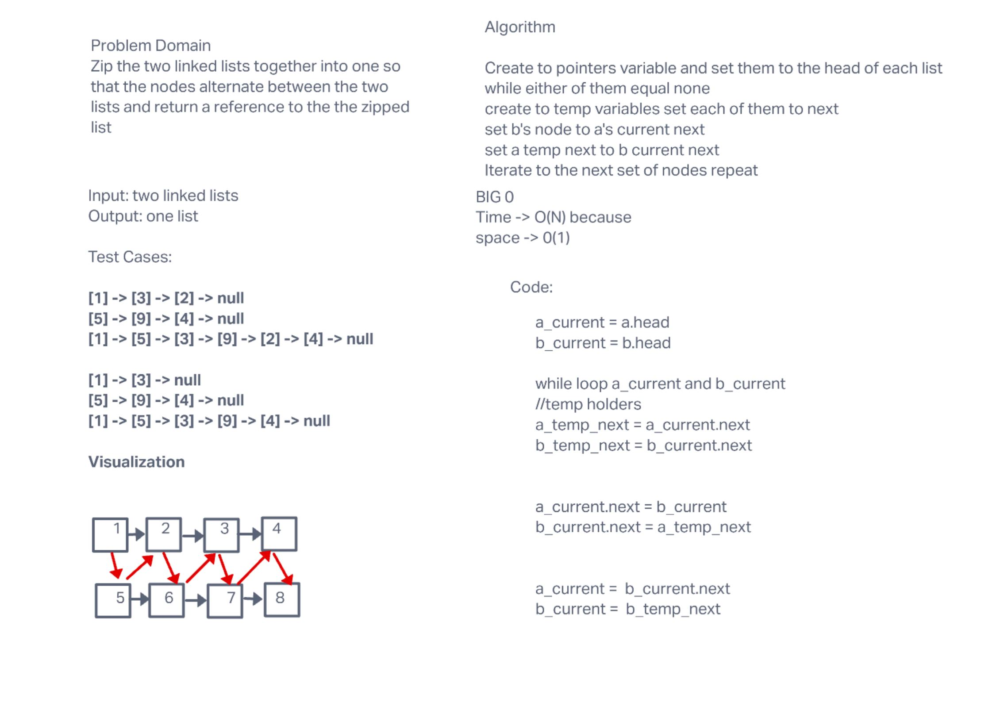

# Code challenges 08

## Singly Linked List Function

linked_list_zip

### Challenge

This is a function for merge zipping two singly linked lists

**The class should contain the following function**

zip()

### Approach & Efficiency

Time -> 0(N)
Space -> 0(1)

