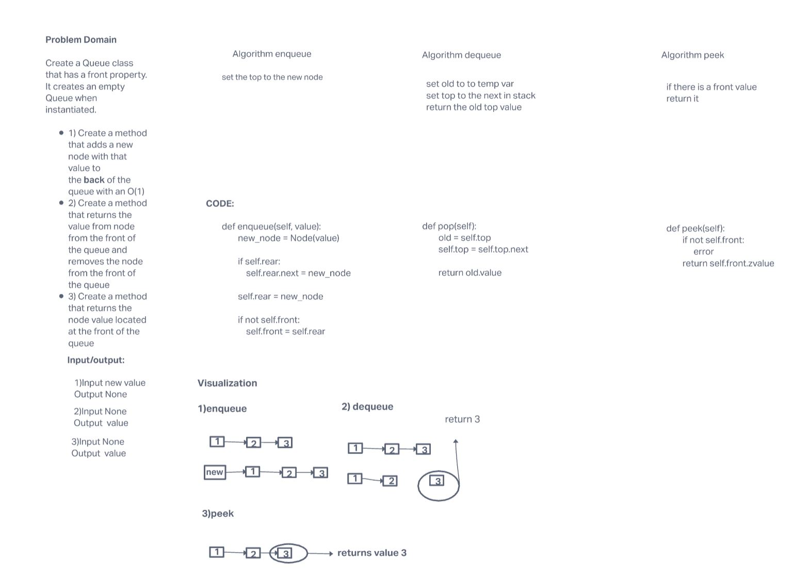
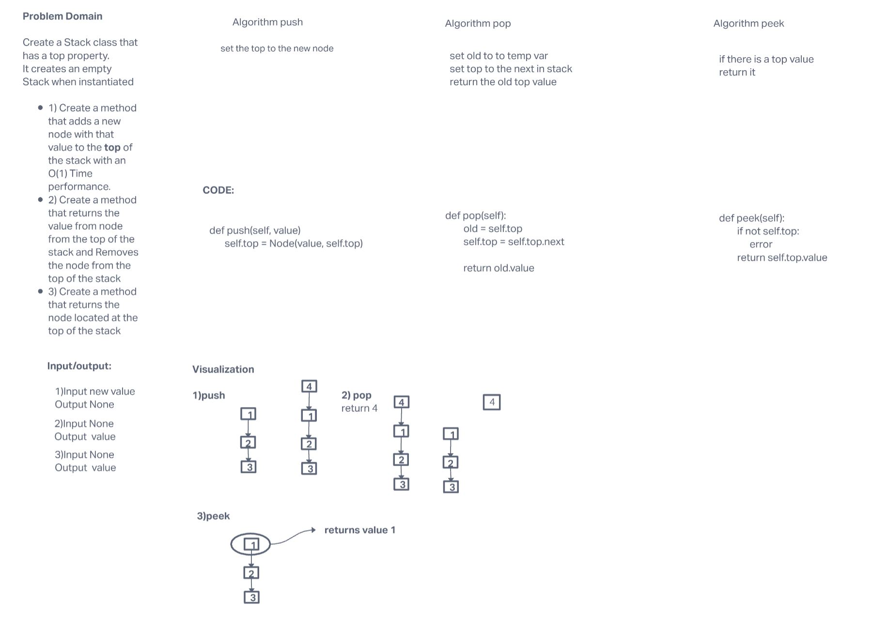

# Stacks and Queues

This module contains the class queue and stack. It contains the following methods.

### Stack

push
pop
peek
isempty

### queue

enqueue
dequeue
peek
isempty

## Challenge

### Node

  Create a Node class that has properties for the value stored in the Node, and a pointer to the next node

### Stack

Create a Stack class that has a top property. It creates an empty Stack when instantiated.

### Queue

Create a Queue class that has a front property. It creates an empty Queue when instantiated.

## Approach & Efficiency

All methods described here have the Time complexity of O(1).
This is because each method takes one step to complete there process.
It does not matter how large or small the queue or stack is they can complete there function with one step.

## API

### Stack

push - Adds new node to top of the stack

pop - removes node form top of stack and returns its value

peek - returns value of the top node

isempty - returns wether stack is empty or not

### Queue

enqueue - Adds new node to back of the queue

dequeue - removes node form front of queue and returns its value

peek - returns value of the front node

isempty - returns wether queue is empty or not

