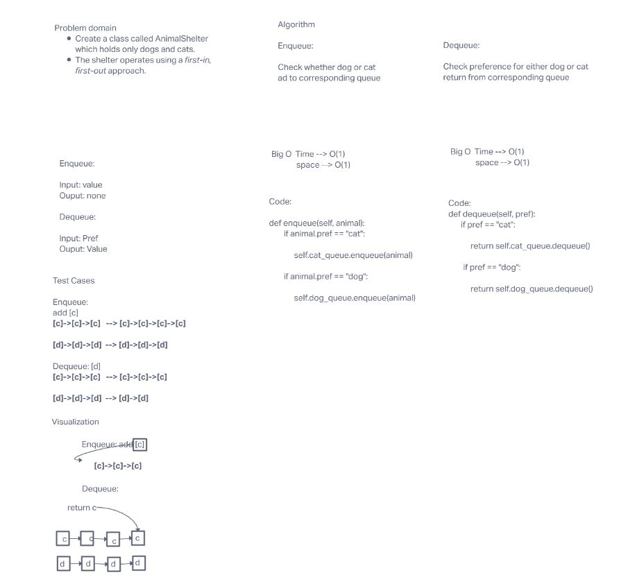

# Challenge Summary

This challenge was is to Create a class called AnimalShelter which holds only dogs and cats.
The shelter operates using a first-in, first-out approach.

## Whiteboard Process

## Approach & Efficiency

First I check whether the node was a dog or cat and add them to corresponding queue.

I then check preference for either dog or cat and return them from corresponding queue

This gave me a O(1) because because no matter how many cats or dogs everyhing takes one step.
