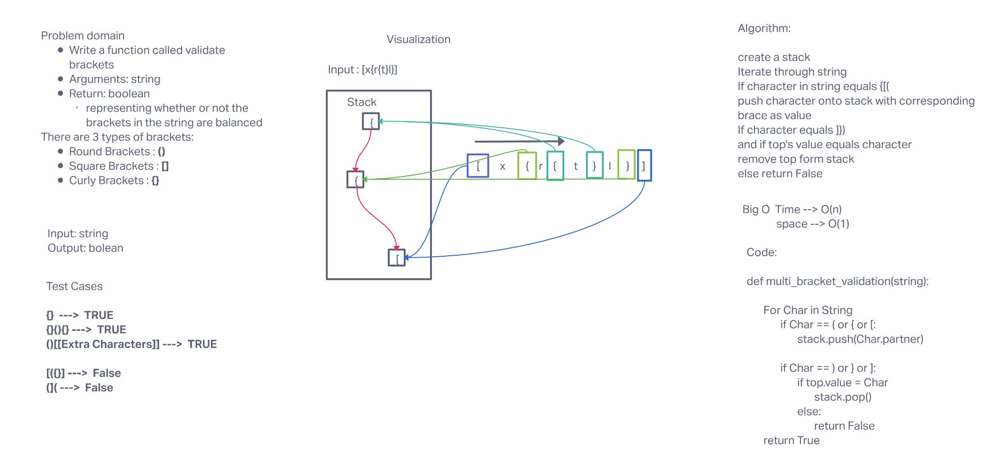

# Challenge Summary

This challenge was is to Create a function that took in a string and checks to see of if the brackets in that string are validated

## Whiteboard Process

## Approach & Efficiency

First it check whether the charater is a closed brace and then pushes its corresponding partner brace onto a stack. It then checks whether a closing brace matches with the top of the stack.

This function has a  O(N) because it will loop as many times as charaters in the string input.
