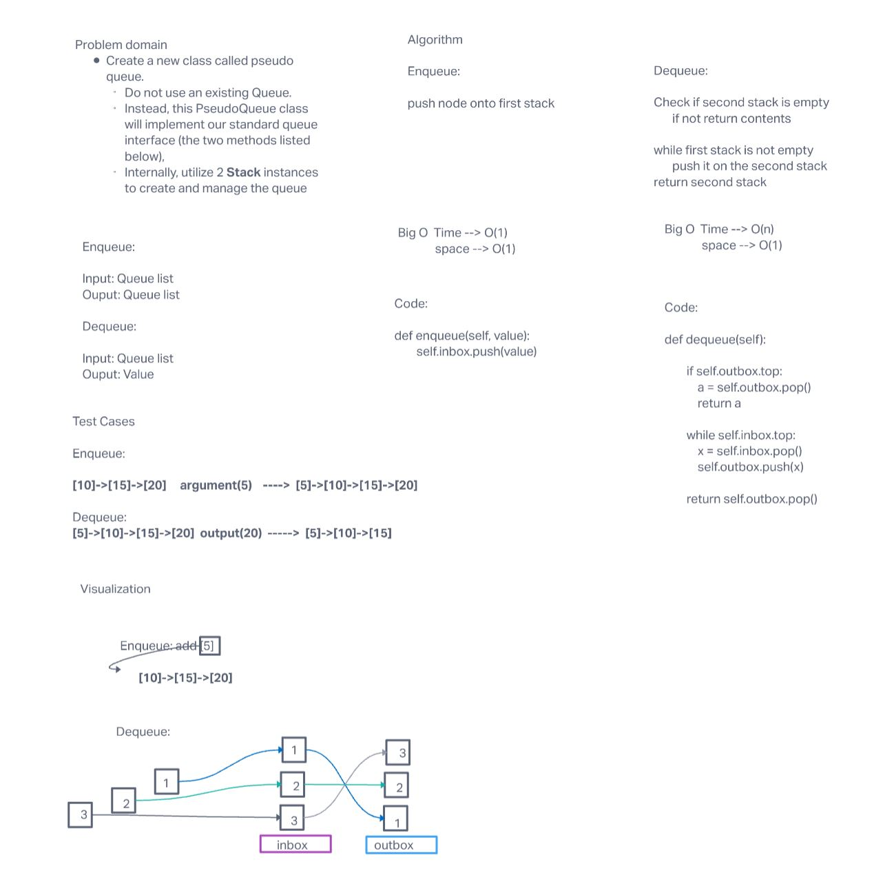

# Challenge Summary
This challenge was to create a undercover Stack inside a Queue.

## Whiteboard Process

## Approach & Efficiency
First I checked whether any valuse was in my outbox. If not I would pop my inbox into my outbox.

This gave me a O(N) because the loop depends on how many items enter the list.

