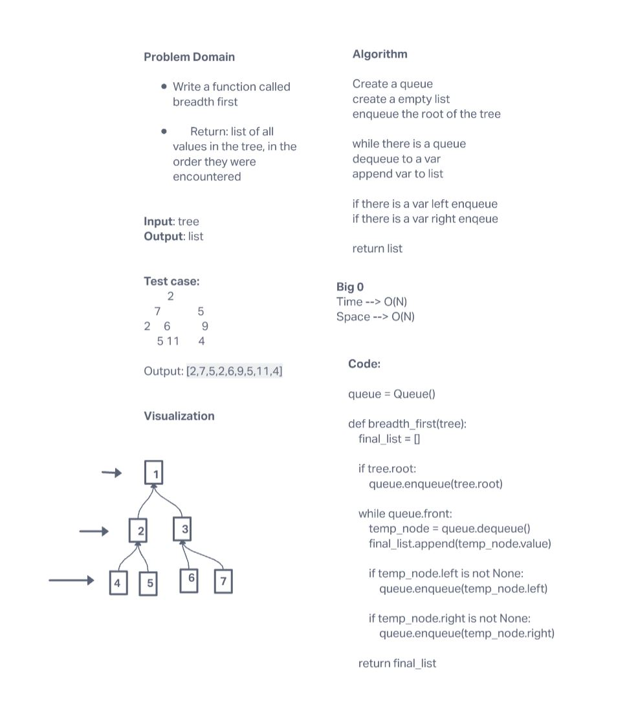

# Challenge Summary

Create a function that takes in a binary tree and returns a list of the trees values in a breadth first order.

## Whiteboard Process

## Approach & Efficiency

My approach takes in each node starting at the root and adds it to a queue. While that queue still contains nodes I transverse the tree add ing each node to the queue by level.

This create a Time complexity of O(N) because we have to traverse the tree and a space complexity of O(N) because of each node will have to be added to the queue.
