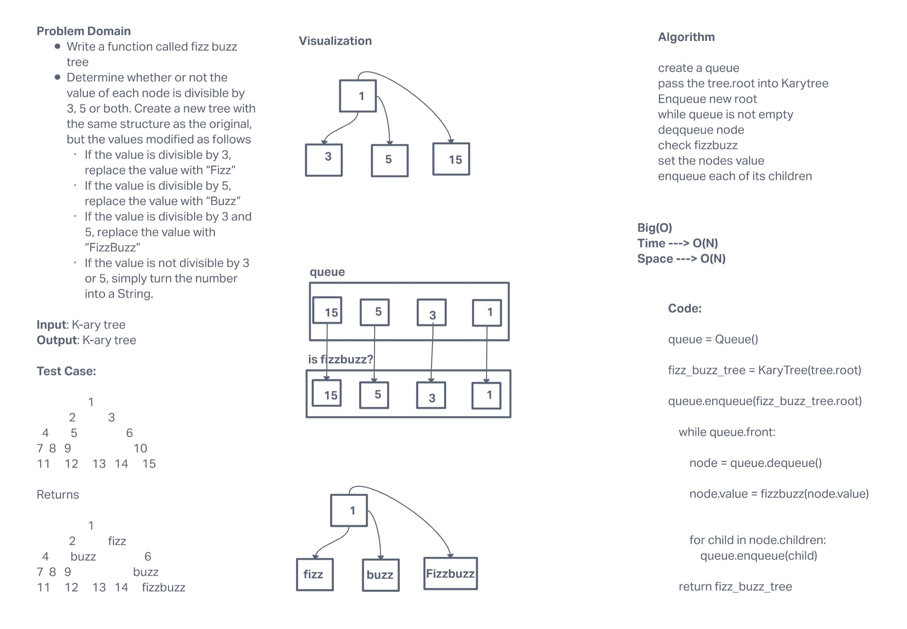

# Challenge Summary

Create a function that takes in a K-ary tree and returns a new K-ary tree with values fizzbuzzed

## Whiteboard Process

## Approach & Efficiency

This approach uses the the breadth search method and passes the nodes value after it is dequeued through a fizzbuzz helper function and returns a new tree with modified values. This results with a big O time complexity O(N) and a space complexity og O(N)
