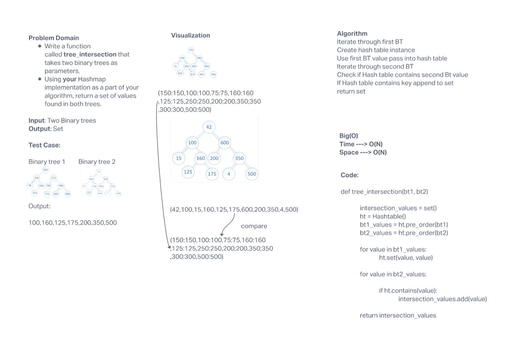

# Code challenges 32

## Challenge

Write a function called `tree_intersection` that takes in two binary trees and returns a set of values found in both trees

## Approach & Efficiency

The algorithms takes in two binary trees and uses `pre_order` method to create two lists of there values. It then maps the first list to a hashtable and uses the `contains` method on each value in the second list to check the hashtable. If it does contain the value it is added to a set. Set is returned.

**Big O**

- Time - O(N) - Beacuse the algorathim must iterate through each binary tree
- Space - O(N)

## Solution

[code](python/code_challenges/tree_intersection.py)
