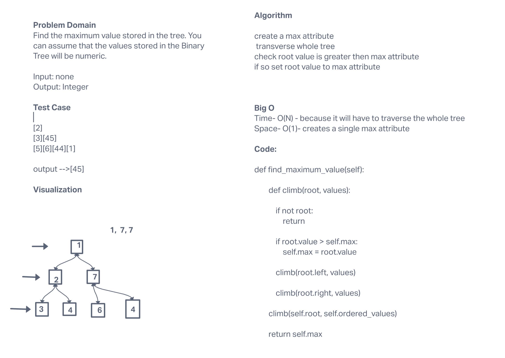

# Code challenges 16

## binary tree

This is a binary tree with the following methods

- find_maximum_value()

### Challenge

Create a method that finds the maximum value in a binary tree

**The class should contain the following methods**

find_maximum_value

- Arguments: None
- Returns: Integer
- Transverses Binary tree and returns highest value

### Approach & Efficiency

find_maximum_value()

- Time - O(N)
- Space - O(1)

